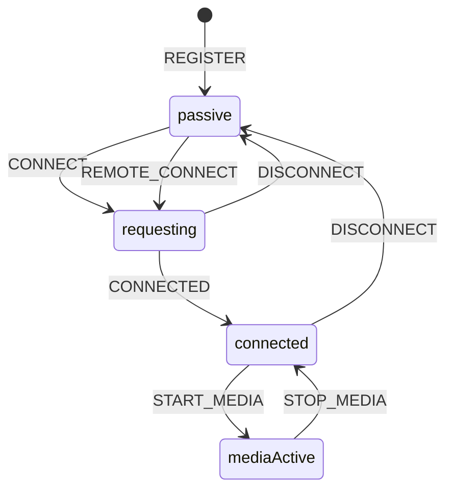

# p2p-lockstep-kit Network Architecture

This network layer provides persistent connectivity and related transport features for P2P applications. It wraps signaling, peer negotiation, state tracking, and transport control behind a small and simple application-facing API.

## Simplified Connection Model

The complex WebRTC connection protocol is reduced to two simple steps for the active side:

1. `register(url)`
2. `connect(targetPeerId)`

The passive side only needs to call:

1. `register(url)`

After registration, the passive peer stays ready in the background. When an incoming `offer` arrives, the network layer automatically handles the remote connection flow, creates the `answer`, exchanges ICE, and completes the peer connection without requiring extra application logic.

```ts
// Active side
await client.register("wss://your-signaling-server");
await client.connect(targetPeerId);

// Passive side
await client.register("wss://your-signaling-server");
```

## Core Design

The module is built around four ideas:

- A state machine records and controls user-facing connection behavior
- Event emission is used to deliver state changes to the upper layer
- Dedicated handlers control concrete peer behavior
- WebRTC primitives are wrapped through multiple layers and exposed as simple operations

## State Machine

The state machine is used to track and control connection flow instead of letting UI logic manipulate WebRTC directly.

- `passive` means no active connection is running
- `requesting` means negotiation has started
- `connected` means the peer connection is actually established

The state machine decides when a peer can connect, disconnect, retry, or return to an idle state. This keeps user operations predictable and prevents upper layers from driving the peer into invalid transitions.



## Event Emission

State changes are pushed outward through event-style callbacks.

- signaling emits incoming relay messages
- peer state changes are emitted to the upper layer
- media state changes are emitted separately

This makes the network layer reactive. The application does not need to poll browser objects directly. It only listens for state updates and reacts to them.

## Handler-Based Peer Control

Concrete peer behavior is driven by dedicated handlers.

- signaling handlers process `offer`, `answer`, and `ice`
- connection handlers react to browser WebRTC state changes
- media handlers control track activation and cleanup
- cleanup handlers tear down stale peer resources during reconnect or disconnect

This keeps transport behavior explicit. The state machine decides what phase the peer is in, while handlers decide what concrete action should happen inside that phase.

## WebRTC Encapsulation

The implementation does not expose raw WebRTC complexity to the application layer.

- `SignalingClient` wraps WebSocket registration, resume, and signal relay
- `RtcPeer` wraps `RTCPeerConnection`, `RTCDataChannel`, ICE exchange, negotiation, and media control
- `NetworkClient` wraps both of them and becomes the single public entry point

The upper layer does not need to manually manage:

- SDP offer and answer flow
- ICE candidate relay
- connection state synchronization
- peer disposal and reconnection cleanup
- media renegotiation

## Signaling Flow

The signaling path is centered on registration first, then SDP and ICE relay.

```text
Client A            Signaling Server             Client B
   |                       |                       |
   |--- WS connect ------->|<------ WS connect ----|
   |--- REGISTER --------->|                       |
   |<-- REGISTERED --------|                       |
   |                       |<-------- REGISTER ----|
   |                       |-------- REGISTERED -->|
   |                       |                       |
   |--- RELAY(offer) ----->|---- RELAY(offer) ---->|
   |<-- RELAY(answer) -----|<--- RELAY(answer) ----|
   |--- RELAY(ice) --------|---- RELAY(ice) ------>|
   |<-- RELAY(ice) --------|<--- RELAY(ice) -------|
   |                       |                       |
   |===== DataChannel open (P2P) ==================|
   |<======== App messages / media sync ==========>|
```

## Network Wire Protocol

The network layer does not define the game-level payload shape such as `GAME_ACTION`. That belongs to the upper layer. At the network layer, the protocol is split into two parts.

### 1. WebSocket Signaling Message

Defined in `utils/protocol/signaling.ts`.

```ts
type SignalType =
  | "REGISTER"
  | "REGISTERED"
  | "RESUME"
  | "RESUMED"
  | "ERROR"
  | "RELAY";

type SignalMessage = {
  type: SignalType;
  from?: string;
  to?: string;
  payload?: {
    id: string;
    data: unknown;
  };
};
```

Typical messages:

```json
{ "type": "REGISTER" }
```

```json
{
  "type": "RESUME",
  "payload": {
    "id": "resume",
    "data": {
      "peerId": "peer-a",
      "resumeToken": "token-123"
    }
  }
}
```

```json
{
  "type": "RELAY",
  "from": "peer-a",
  "to": "peer-b",
  "payload": {
    "id": "offer",
    "data": {}
  }
}
```

### 2. Internal Peer Relay Message

Inside `network/signaling/client.ts`, `RELAY` is converted into a more concrete peer-level message:

```ts
type SignalMessage = {
  from: string;
  to: string;
  type: "offer" | "answer" | "ice";
  payload: RTCSessionDescriptionInit | RTCIceCandidateInit;
};
```

Typical peer relay messages:

```json
{
  "from": "peer-a",
  "to": "peer-b",
  "type": "offer",
  "payload": {}
}
```

```json
{
  "from": "peer-b",
  "to": "peer-a",
  "type": "answer",
  "payload": {}
}
```

```json
{
  "from": "peer-a",
  "to": "peer-b",
  "type": "ice",
  "payload": {}
}
```

### 3. DataChannel Payload

The DataChannel payload is intentionally opaque at the network layer.

- `NetworkClient.send(data)` encodes arbitrary JSON
- `NetworkClient.onMessage(handler)` decodes and delivers arbitrary JSON
- the network layer transports application payloads, but does not define the application protocol schema

## Public API

The application only interacts with a small set of methods:

```ts
const client = new NetworkClient();

await client.register("wss://your-signaling-server");
await client.connect(targetPeerId);

client.onMessage((payload) => {
  console.log(payload);
});

client.send({ type: "move", x: 3, y: 5 });
```

Optional media control is also exposed through simple methods:

```ts
client.startMedia(stream);
client.stopMedia();
```

## Summary

This module uses a state machine to record and control user operations, emits state changes outward, uses handlers to control peer behavior, and encapsulates WebRTC across several layers. The result is a simplified entry point for building P2P applications without exposing the full complexity of browser networking APIs.
